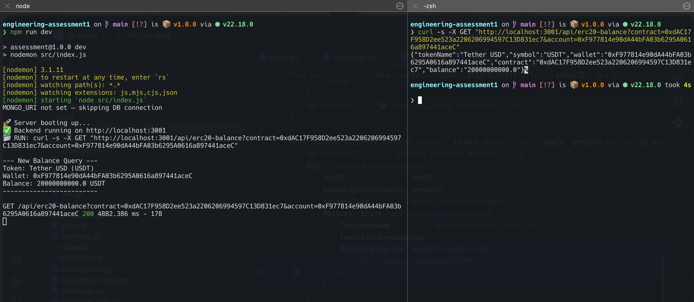

# SpaceDev

## ❯❯❯❯ Flow

1. **Server Startup**: Node.js backend initializes on port 3001.
2. **API Request**: A `curl` command triggers the `/api/erc20-balance` endpoint.
3. **Smart Contract Interactivity**: The system successfully queries the USDT contract on Ethereum Mainnet.
4. **Final Result**: The balance and token metadata are returned correctly in the terminal.

## ✅ Proof

The following screenshot demonstrates the end-to-end flow:



## 🚀 Quick Start Guide

To run and test the project locally:

```bash
# Clone the repository (if provided)
git clone [repo-url]

# Move into the project directory
cd [project-folder]

# Install dependencies
npm install

# Start the server
npm run dev

# Hit the new API to fetch erc20-contract balance of a wallet (use any contract & account in params)
curl -s -X GET "http://localhost:3001/api/erc20-balance?contract=0xdAC17F958D2ee523a2206206994597C13D831ec7&account=0xF977814e90dA44bFA03b6295A0616a897441aceC"

